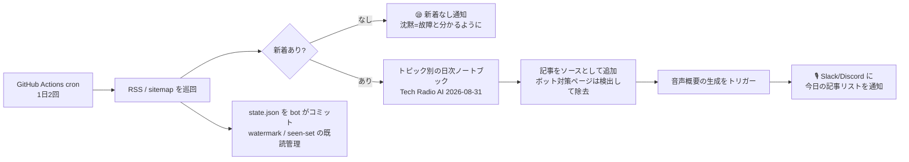

# notebooklm-radio

**毎朝の技術ニュースを、作らなくていいポッドキャストに。**

[English README is here](README.md)

notebooklm-radio は、あなたが追いたい RSS フィードやサイトマップを巡回し、新着記事を毎朝 NotebookLM の**音声概要**(2人のホストが語り合うラジオ形式、言語は選択可)に変換して、今日のエピソードの内容を Slack / Discord に通知します。GitHub Actions の cron だけで完結し、サーバーもデータベースも不要です。

動機はひとつの具体的な悩みでした — *英語の技術記事は読む速度より速く積み上がるが、通勤には40分の「耳の空き時間」がある。* 既定は日本語ですが、NotebookLM が対応する言語なら何語でも使えます。

## ⚠️ 使う前に読んでください

- このプロジェクトは [notebooklm-py](https://github.com/teng-lin/notebooklm-py) という**非公式のリバースエンジニアリング製クライアント**で NotebookLM を操作します。Google は予告なく NotebookLM を変更でき、その日このパイプライン全体が止まる可能性があります。
- 認証には**あなた自身の Google セッション Cookie** を使い、**あなた自身のリポジトリ**の GitHub Actions シークレットに保存します。認証情報が他所へ送られることはありません。**自分のアカウントでの個人利用専用**であり、他人の認証情報を預かるサービスにしてはいけません。
- セッションは約 **3.5 週間**で失効し、手動での再ログインが必要です(2分で終わる手順書つき)。これはバグではなく構造的な制約です — 理由は [docs/OPERATIONS.md](docs/OPERATIONS.md) に書いてあります。
- 生成される音声は他者の記事の要約です。**個人で聴く用途**にとどめ、エピソードを自分のポッドキャストとして再配信しないでください。

## 仕組み



「1,226 件の誤新着」「16 日間の無音認証切れ」といった実際の事故から得た設計は [docs/DESIGN.md](docs/DESIGN.md) と [docs/OPERATIONS.md](docs/OPERATIONS.md) に記録しています。

## クイックスタート

必要なもの: GitHub アカウント、NotebookLM が使える Google アカウント、Slack か Discord の webhook、初回ログイン用のブラウザが動く PC。

**1. 自分のコピーを作る** — **Use this template → Create a new repository** をクリック。**Private** を選んでください(bot があなたの購読履歴を `state.json` にコミットするため)。

**2. ローカルで NotebookLM にログインして認証情報を取る:**

```bash
uv tool install "notebooklm-py[browser]"
notebooklm -p ci login        # ブラウザが開くので、普通に Google にログイン
```

セッションが `~/.notebooklm/profiles/ci/storage_state.json` に保存されます。`-p ci` は意図的です: CI 用セッションを普段使いと分けると、認証情報の寿命が約 3 日 → 約 3.5 週間に延びます(実測。[docs/OPERATIONS.md](docs/OPERATIONS.md) 参照)。

**3. シークレットを 2 つ登録する**(リポジトリ → Settings → Secrets and variables → Actions、または CLI):

```bash
gh secret set NOTEBOOKLM_AUTH_JSON < ~/.notebooklm/profiles/ci/storage_state.json
gh secret set NOTIFY_WEBHOOK_URL   # Slack incoming webhook か Discord webhook の URL
```

Slack / Discord は URL から自動判別されます。

**4. 一度手で回す** — リポジトリ → Actions タブ →(表示されたら)ワークフローを有効化 → *RSS Radio Automation* → **Run workflow**。数分で webhook に通知が届き、[NotebookLM](https://notebooklm.google.com) に `Tech Radio AI 2026-08-31` のようなノートブックができて音声生成が始まれば成功です。初回は既読状態の初期化として、各フィード最新 1 件だけを処理し、過去分は既読になります(洪水は起きません)。

**5. 自分仕様にする** — `config.yaml` を編集してフィードを差し替え、`language`・`timezone`・音声のスタイルプロンプトを設定。`.github/workflows/rss-radio.yml` の cron は JST の朝を想定しているので、自分のタイムゾーンに合わせてください。

セットアップはこれで全部です。以後は勝手に回ります。`state.json` は bot が作ってコミットします — 手で編集しないでください。

## 設定リファレンス

すべて `config.yaml` にあります(インラインの注釈つき):

| キー | 何をするか |
|---|---|
| `feeds[].topic` | トピックごとに 1 日 1 ノートブック + 1 ラジオ。無関係な話題を混ぜると番組が散らかるので分ける。 |
| `feeds[].type: sitemap` | RSS の無いサイト向け。`sitemap.xml` を読み、`prefix` 配下の URL を記事として扱う。 |
| `feeds[].source_mode: text` | ボット対策で NotebookLM のフェッチャーが弾かれるホスト向け。URL の代わりに RSS の要約をテキスト投入し、「要約のみ」と明示する。 |
| `settings.notebook_title_format` | 自動削除はこの形式に**完全一致**するタイトルだけが対象。手動で作ったノートブックには構造的に触れない。 |
| `settings.timezone` | ノートブックの日付と月次判定の基準。runner は UTC なので必ず自分のものを。 |
| `settings.limits` | 1 回に処理する記事数。超過分は捨てずに次回へ持ち越し。 |
| `settings.audio` | 音声概要に渡す長さとスタイル指示。 |
| `settings.cleanup` | 古い日次ノートブックの自動削除。`dry_run: true` で出荷 — 削除予定リストが正しいのを確認してから false に。 |
| `watch:` | 通知だけのページ監視(ラジオ化はしない)。 |

## 運用

- **認証は約 3.5 週間で切れます。** 原因を名指しするエラー通知が届くので、手順 2 と手順 3 の 1 行目をやり直せば復旧します。手順書: [docs/OPERATIONS.md](docs/OPERATIONS.md)。
- **沈黙は故障です。** 新着ゼロの日も 😪 の通知が来ます。何も来なければ Actions タブを確認。
- **音声生成は fire-and-forget。** 通知は「生成を開始した」であり、Google 側でレンダリングが失敗しても実行は失敗になりません。
- **Private リポジトリの Actions 無料枠:** 1 日 2 回なら余裕で収まります(実行は通常数分。30 分はワーストケースのタイムアウト)が、使用量には気を配ってください。

## 設計ノート

エンジニアリング的に面白いのは既読管理です。RSS フィードは **watermark**(最後に処理した記事の公開時刻)、sitemap フィードは **既読 URL 集合**を使っており、どちらの方式も相手のフィード型に使うと実際の事故につながります。その顛末、ボット対策ページの検出、そしてこのプロジェクトが**あえてやらないこと**(User-Agent 偽装、プラグインシステム化)は [docs/DESIGN.md](docs/DESIGN.md) にあります。

## サポート

ベストエフォートです。issue も PR も歓迎ですが、これは「たまたま共有できる形にした、ひとりの朝のラジオ」です — 誠実な返答はしますが SLA はありません。NotebookLM 側が変われば、notebooklm-py が追従するまで止まります。

## クレジットとライセンス

- Powered by [notebooklm-py](https://github.com/teng-lin/notebooklm-py) (MIT) by Teng Lin — このプロジェクトが呼び出している非公式 NotebookLM CLI です。ここにあるものは何ひとつ、これ無しでは動きません。スターを送りましょう。
- ライセンス: [MIT](LICENSE)
