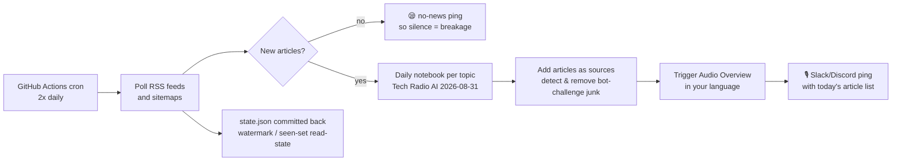

# notebooklm-radio

**Your daily tech news, as a podcast you didn't have to make.**

[日本語版 README はこちら](README.ja.md)

notebooklm-radio polls the RSS feeds and sitemaps you care about, and every morning turns the new articles into a NotebookLM **Audio Overview** — a two-host conversational radio show, in your language — then pings you on Slack or Discord with what's in today's episode. It runs entirely on GitHub Actions cron: no server, no database, nothing to keep alive.

Built for one concrete itch: *English tech articles pile up faster than you can read them, but your commute has 40 free minutes of ears.* Japanese-first by default (the author listens in Japanese), works in any language NotebookLM supports.

## ⚠️ Read this before using

- This project drives NotebookLM through [notebooklm-py](https://github.com/teng-lin/notebooklm-py), an **unofficial, reverse-engineered client**. Google can change or break NotebookLM at any time, without notice, and this whole pipeline with it.
- It authenticates with **your own Google session cookies**, stored as a GitHub Actions secret in **your own repository**. This template never sends your credentials anywhere else, and it is designed for **personal use with your own account only** — it is not a service, and it must not become one that holds other people's credentials.
- The session expires roughly every **3.5 weeks** and must be renewed by hand (2 minutes; there is a runbook). This is a structural limitation, not a bug — [docs/OPERATIONS.md](docs/OPERATIONS.md) explains why it cannot renew itself.
- Generated audio summarizes other people's articles. Keep it for **personal listening**; do not republish episodes as your own podcast.

## How it works



Details that took real incidents to get right (1,226 falsely-new articles, a 16-day silent auth outage) are documented in [docs/DESIGN.md](docs/DESIGN.md) and [docs/OPERATIONS.md](docs/OPERATIONS.md).

## Quick start

You need: a GitHub account, a Google account with NotebookLM access, a Slack or Discord webhook, and a machine with a browser for the one-time login.

**1. Create your copy** — click **Use this template → Create a new repository**. Choose **Private** (the bot commits your reading history into `state.json`).

**2. Log in to NotebookLM locally and capture credentials:**

```bash
uv tool install "notebooklm-py[browser]"
notebooklm -p ci login        # a browser window opens — log in to Google normally
```

This saves your session to `~/.notebooklm/profiles/ci/storage_state.json`. The `-p ci` profile is deliberate: keeping the CI session separate from your everyday one extends the credential's life from ~3 days to ~3.5 weeks (measured — see [docs/OPERATIONS.md](docs/OPERATIONS.md)).

**3. Set the two secrets** (repo → Settings → Secrets and variables → Actions, or via CLI):

```bash
gh secret set NOTEBOOKLM_AUTH_JSON < ~/.notebooklm/profiles/ci/storage_state.json
gh secret set NOTIFY_WEBHOOK_URL   # paste your Slack incoming-webhook or Discord webhook URL
```

Slack and Discord are auto-detected from the URL.

**4. Run it once** — repo → Actions tab → enable workflows if prompted → *RSS Radio Automation* → **Run workflow**. Within a few minutes you should get a webhook ping, and a notebook named like `Tech Radio AI 2026-08-31` appears in [NotebookLM](https://notebooklm.google.com) with audio generating. The first run initializes read-state: it processes only the latest article per feed and marks the backlog as read (no flood).

**5. Make it yours** — edit `config.yaml`: swap in your feeds, set `language`, `timezone`, and the audio style prompt. The cron schedule in `.github/workflows/rss-radio.yml` assumes JST mornings; shift it to your timezone.

Don't know which feeds to add? **[tech-feed-catalog](https://inoueuj.github.io/tech-feed-catalog/)** is a companion catalog of continuously validated developer feeds — filter by topic, tick the ones you want, and copy a `config.yaml` block straight into this file. It also marks which feeds actually make good radio, since a one-line changelog firehose and a long-form engineering blog need very different handling.

That's the whole setup. From now on it runs by itself; `state.json` is created and committed by the bot — never edit it by hand.

## Configuration reference

Everything lives in `config.yaml` (annotated inline):

| Key | What it does |
|---|---|
| `feeds[].topic` | One notebook + one radio per topic per day. Mixing unrelated topics makes the show incoherent — split them. |
| `feeds[].type: sitemap` | For sites with no RSS: reads `sitemap.xml`, treats URLs under `prefix` as articles. |
| `feeds[].source_mode: text` | For hosts that block NotebookLM's fetcher with a bot challenge: submits the RSS summary as text instead of the URL, clearly labeled as summary-only. |
| `feeds[].mode: latest` | For aggregators and other firehoses: each run takes only the newest N and deliberately marks the rest read, instead of draining a backlog oldest-first. |
| `topics.<name>.audio` | Per-topic Audio Overview overrides — `format` (deep-dive / brief / critique / debate), `length`, `prompt`, `language`. |
| `settings.notebook_title_format` | Cleanup only deletes notebooks whose title **fully matches** this — your manual notebooks are structurally safe. |
| `settings.timezone` | Notebook dates and monthly checks. Runners are UTC; set your own. |
| `settings.limits` | Articles per run. Overflow is carried over to the next run, never dropped. |
| `settings.audio` | Global Audio Overview settings: `format`, `length`, `prompt`, and `scope` (`run`, the default: each episode covers only that run's articles; `notebook`: the whole day). |
| `settings.cleanup` | Auto-delete of old daily notebooks. Ships with `dry_run: true` — flip only after the would-delete list looks right. |
| `watch:` | Notification-only page monitoring (never becomes radio). |

Validate your edits without running anything: `python radio_batch.py --check-config`. It reads only `config.yaml` — no network, no NotebookLM — and CI runs the same check before every batch, so a typo (`feed:` instead of `feeds:`, `topics:` inside a feed) stops with a readable message instead of silently falling back to defaults. The full shape is documented in [`config.schema.json`](config.schema.json).

## Operations

- **Auth expires ~every 3.5 weeks.** You'll get an error notification naming the cause; recovery is re-running step 2 and step 3's first command. Full runbook: [docs/OPERATIONS.md](docs/OPERATIONS.md).
- **Silence means breakage.** A no-news day still sends a 😪 ping. If you hear nothing at all, check the Actions tab.
- **Audio generation is fire-and-forget.** The notification says generation *started*; a failed render on Google's side does not fail the run. If generation can't even be *started* (typically NotebookLM's daily Audio Overview quota: 3 on the free tier), the articles are still in the notebook and you get a separate error message with the cause — generate the overview by hand in the app.
- **Private repos and Actions minutes:** two runs/day fits comfortably in the free tier (runs are typically a few minutes; 30 min is a worst-case timeout), but keep an eye on your usage.

## Design notes

The interesting engineering is in the read-state: RSS feeds use a **watermark** (last processed publish time) while sitemap feeds use a **seen-URL set**, and each choice is wrong for the other type in ways that produced real incidents. That story, plus the bot-challenge detection and the things this project deliberately does *not* do (spoof User-Agents, grow a plugin system), is in [docs/DESIGN.md](docs/DESIGN.md).

## Support

Best-effort. Issues and PRs are welcome, but this is one person's morning radio that happens to be shareable — expect honest answers, not SLAs. If NotebookLM changes upstream, expect breakage until notebooklm-py catches up.

## Credits & license

- Powered by [notebooklm-py](https://github.com/teng-lin/notebooklm-py) (MIT) by Teng Lin — the unofficial NotebookLM CLI this project shells out to. Consider starring it; nothing here works without it.
- License: [MIT](LICENSE).
