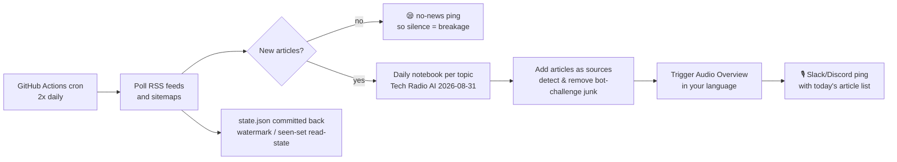

# notebooklm-radio

**Your daily tech news, as a podcast you didn't have to make.**

[日本語版 README はこちら](README.ja.md)

notebooklm-radio polls the RSS feeds and sitemaps you care about, and every morning turns the new articles into a NotebookLM **Audio Overview** — a two-host conversational radio show, in your language — then pings you on Slack or Discord with what's in today's episode. It runs entirely on GitHub Actions cron: no server, no database, nothing to keep alive.

Built for one concrete itch: *English tech articles pile up faster than you can read them, but your commute has 40 free minutes of ears.* Japanese-first by default (the author listens in Japanese), works in any language NotebookLM supports.

**→ [Setup guide with screenshots](https://inoueuj.github.io/tech-feed-catalog/guide/?lang=en)** — ten steps from picking feeds to your first episode, plus what to do every morning and every 3.5 weeks. [日本語版](https://inoueuj.github.io/tech-feed-catalog/guide/?lang=ja). Feeds come from **[tech-feed-catalog](https://github.com/inoueUJ/tech-feed-catalog)** ([builder](https://inoueuj.github.io/tech-feed-catalog/) · [feeds.json](https://inoueuj.github.io/tech-feed-catalog/feeds.json)).

## ⚠️ Read this before using

- This project drives NotebookLM through [notebooklm-py](https://github.com/teng-lin/notebooklm-py), an **unofficial, reverse-engineered client**. Google can change or break NotebookLM at any time, without notice, and this whole pipeline with it.
- It authenticates with **your own Google session cookies**, stored as a GitHub Actions secret in **your own repository**. This template never sends your credentials anywhere else, and it is designed for **personal use with your own account only** — it is not a service, and it must not become one that holds other people's credentials.
- The session expires roughly every **3.5 weeks** and must be renewed by hand (2 minutes; there is a runbook). This is a structural limitation, not a bug — [docs/OPERATIONS.md](docs/OPERATIONS.md) explains why it cannot renew itself.
- Generated audio summarizes other people's articles. Keep it for **personal listening**; do not republish episodes as your own podcast.

## How it works


```mermaid
flowchart LR
    A[GitHub Actions cron<br/>2x daily] --> B[Poll RSS feeds<br/>and sitemaps]
    B --> C{New articles?}
    C -- no --> D[😪 no-news ping<br/>so silence = breakage]
    C -- yes --> E[Daily notebook per topic<br/>Tech Radio AI 2026-08-31]
    E --> F[Add articles as sources<br/>detect & remove bot-challenge junk]
    F --> G[Trigger Audio Overview<br/>in your language]
    G --> H[🎙️ Slack/Discord ping<br/>with today's article list]
    B --> I[state.json committed back<br/>watermark / seen-set read-state]
```

Details that took real incidents to get right (1,226 falsely-new articles, a 16-day silent auth outage) are documented in [docs/DESIGN.md](docs/DESIGN.md) and [docs/OPERATIONS.md](docs/OPERATIONS.md).

## Where to look

| You want to… | Read |
|---|---|
| Set it up step by step, with screenshots | **[The setup guide](https://inoueuj.github.io/tech-feed-catalog/guide/?lang=en)** (web page, English / [日本語](https://inoueuj.github.io/tech-feed-catalog/guide/?lang=ja)) |
| Get running in five minutes | The quick start below |
| Read the same guide as one Markdown file (grep-able), change settings, read the notifications, fix a problem | [docs/GUIDE.md](docs/GUIDE.md) |
| Pick feeds and generate a config | [The config builder](https://inoueuj.github.io/tech-feed-catalog/) |
| Browse the validated feed catalog (70+ developer feeds, checked weekly) | [tech-feed-catalog](https://github.com/inoueUJ/tech-feed-catalog) · [feeds.json](https://inoueuj.github.io/tech-feed-catalog/feeds.json) |
| Know every key config.yaml accepts | [config.schema.json](config.schema.json) |
| Know why it is built this way | [docs/DESIGN.md](docs/DESIGN.md) |
| Renew the credential, read the incident log | [docs/OPERATIONS.md](docs/OPERATIONS.md) |

## Quick start

The full walkthrough with screenshots is **[the setup guide](https://inoueuj.github.io/tech-feed-catalog/guide/?lang=en)**. The short version:

1. **Build your config** in [the builder](https://inoueuj.github.io/tech-feed-catalog/): tap the feeds you follow (or add a Zenn topic, a Qiita tag, any feed URL), group them into shows, choose when to listen, then download `config.yaml` and copy the two cron lines. The page warns about the daily Audio Overview quota vs. shows × runs, firehose feeds, duplicate feeds and bot-blocked hosts before they bite.
2. **Use this template → Create a new repository**, **Private** (the bot commits your read-state to `state.json`), then clone it.
3. **Drop the config in**: replace `config.yaml` with the downloaded file and the two `- cron:` lines in `.github/workflows/rss-radio.yml` with the builder's, check it with `python radio_batch.py --check-config` (reads the file, runs nothing), and push.
4. **Run the wizard once** on your PC (needs Python 3.10+, [uv](https://docs.astral.sh/uv/getting-started/installation/) and the [GitHub CLI](https://cli.github.com/) after `gh auth login`; the wizard tells you what is missing):

   ```bash
   python scripts/setup.py
   ```

   It installs the pinned `notebooklm` CLI, opens a browser for a Google login into a CI-only `ci` profile (kept apart from your everyday profile, which stretches the credential's life from ~3 days to ~3.5 weeks — see [docs/OPERATIONS.md](docs/OPERATIONS.md)), stores that session as the `NOTEBOOKLM_AUTH_JSON` secret, asks for your Slack or Discord webhook URL and stores it as `NOTIFY_WEBHOOK_URL`, and starts the first run. Nothing about the credential is printed. `python scripts/setup.py doctor` runs the checks only.
5. **Listen.** Within minutes a notification lists today's articles with a link to each notebook; the audio is ready in [NotebookLM](https://notebooklm.google.com) about 20 minutes later. The first run processes only the newest article per feed and marks the backlog read (no flood). After about a week, when the 🧹 dry-run message lists only old episodes, set `cleanup.dry_run: false`.

That is the whole setup; from here on it runs by itself. `state.json` is written and committed by the bot — never edit it by hand. Every ~3.5 weeks the Google session expires and the error notification says so; the fix is `python scripts/setup.py renew` (two minutes).

## Configuration reference

Everything lives in `config.yaml` (annotated inline):

| Key | What it does |
|---|---|
| `feeds[].topic` | One notebook + one radio per topic per day. Mixing unrelated topics makes the show incoherent — split them. |
| `feeds[].type: sitemap` | For sites with no RSS: reads `sitemap.xml`, treats URLs under `prefix` as articles. |
| `feeds[].source_mode: text` | For hosts that block NotebookLM's fetcher with a bot challenge: submits the RSS summary as text instead of the URL, clearly labeled as summary-only. |
| `feeds[].mode: latest` | For aggregators and other firehoses: each run takes only the newest N and deliberately marks the rest read, instead of draining a backlog oldest-first. |
| `topics.<name>.audio` | Per-topic Audio Overview overrides — `format` (deep-dive / brief / critique / debate), `length`, `prompt`, `language`. |
| `settings.notebook_title_format` | Cleanup only deletes notebooks whose title **fully matches** this — your manual notebooks are structurally safe. |
| `settings.timezone` | Notebook dates and monthly checks. Runners are UTC; set your own. |
| `settings.limits` | Articles per run. Overflow is carried over to the next run, never dropped. |
| `settings.audio` | Global Audio Overview settings: `format`, `length`, `prompt`, and `scope` (`run`, the default: each episode covers only that run's articles; `notebook`: the whole day). |
| `settings.cleanup` | Auto-delete of old daily notebooks. Ships with `dry_run: true` — flip only after the would-delete list looks right. |
| `watch:` | Notification-only page monitoring (never becomes radio). |

Validate your edits without running anything: `python radio_batch.py --check-config`. It reads only `config.yaml` — no network, no NotebookLM — and CI runs the same check before every batch, so a typo (`feed:` instead of `feeds:`, `topics:` inside a feed) stops with a readable message instead of silently falling back to defaults. The full shape is documented in [`config.schema.json`](config.schema.json).

## Operations

- **Auth expires ~every 3.5 weeks.** You'll get an error notification naming the cause; recovery is re-running step 2 and step 3's first command. Full runbook: [docs/OPERATIONS.md](docs/OPERATIONS.md).
- **Silence means breakage.** A no-news day still sends a 😪 ping. If you hear nothing at all, check the Actions tab.
- **Audio generation is fire-and-forget.** The notification says generation *started*; a failed render on Google's side does not fail the run. If generation can't even be *started* (typically NotebookLM's daily Audio Overview quota: 3 on the free tier), the articles are still in the notebook and you get a separate error message with the cause — generate the overview by hand in the app.
- **Private repos and Actions minutes:** two runs/day fits comfortably in the free tier (runs are typically a few minutes; 30 min is a worst-case timeout), but keep an eye on your usage.

## Design notes

The interesting engineering is in the read-state: RSS feeds use a **watermark** (last processed publish time) while sitemap feeds use a **seen-URL set**, and each choice is wrong for the other type in ways that produced real incidents. That story, plus the bot-challenge detection and the things this project deliberately does *not* do (spoof User-Agents, grow a plugin system), is in [docs/DESIGN.md](docs/DESIGN.md).

## Support

Best-effort. Issues and PRs are welcome, but this is one person's morning radio that happens to be shareable — expect honest answers, not SLAs. If NotebookLM changes upstream, expect breakage until notebooklm-py catches up.

## Credits & license

- Powered by [notebooklm-py](https://github.com/teng-lin/notebooklm-py) (MIT) by Teng Lin — the unofficial NotebookLM CLI this project shells out to. Consider starring it; nothing here works without it.
- License: [MIT](LICENSE).
