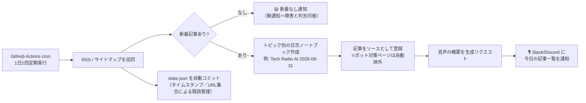

# notebooklm-radio

毎朝、追っている技術ニュースを「自分専用のラジオ番組」として自動生成・配信するツールです。

RSS やサイトマップから新着記事を自動で取得し、Google NotebookLM の「音声の概要（ホスト2名による対談形式）」を作成して Slack / Discord に通知します。GitHub Actions の定期実行（cron）だけで動くため、自前のサーバーやデータベースは一切不要です。

## 概要

気になる技術ブログやサイトを登録しておくだけで、新着記事をピックアップして NotebookLM の対談ラジオ（ポッドキャスト）を自動生成します。朝の通勤時間や作業中など、「記事を読む時間は取れないけれど、耳なら使える」というスキマ時間での情報収集に是非!!!

音声の言語はデフォルトで日本語に対応しており、NotebookLM がサポートする他の言語に変更することも可能です。

画面付きの詳しいセットアップ手順や設定方法は以下URLで公開しています。

- **導入ガイド**: [Web版 導入ガイド](https://inoueuj.github.io/tech-feed-catalog/guide/)
- **設定ビルダー（Web UI）**: [tech-feed-catalog 設定ビルダー](https://inoueuj.github.io/tech-feed-catalog/)（配信元の選択と `config.yaml` の生成）
- **おすすめフィード一覧**: [tech-feed-catalog](https://github.com/inoueUJ/tech-feed-catalog) ([feeds.json](https://inoueuj.github.io/tech-feed-catalog/feeds.json))

## ⚠️ ご利用前の注意事項

- **公式 API ではありません**: NotebookLM には公式 API が提供されていないため、非公式ライブラリ（[notebooklm-py](https://github.com/teng-lin/notebooklm-py)）を利用してブラウザ操作を自動化しています。Google 側の仕様変更によって動作しなくなる可能性があります。
- **個人利用を前提とした設計**: ご自身の Google アカウントの認証情報（セッション Cookie）を GitHub Actions の Secrets に登録して利用します。認証情報が外部に送信されることはありませんが、第三者に提供するサービスとしての運用は想定していません。
- **定期的な再ログインが必要（約3.5週間ごと）**: Google のセッション有効期限（約3.5週間）が切れると動作が停止します。その際は手元で専用スクリプトを実行し、ブラウザから再ログインを行ってください（所要時間は2分程度です）。仕様上の背景については [docs/OPERATIONS.md](docs/OPERATIONS.md) をご参照ください。
- **私的利用の範囲でご使用ください**: 生成される音声は各記事の要約です。著作権および各種規約に配慮し、ご自身で聴く範囲にとどめ、ポッドキャスト等での一般公開や再配信は行わないでください。

## 処理の流れ

```mermaid
flowchart LR
    A[GitHub Actions cron<br/>1日2回定期実行] --> B[RSS / サイトマップを巡回]
    B --> C{新着記事あり?}
    C -- なし --> D[😪 新着なし通知<br/>（無通知＝障害と判別可能）]
    C -- あり --> E[トピック別の日次ノートブック作成<br/>例: Tech Radio AI 2026-08-31]
    E --> F[記事をソースとして登録<br/>※ボット対策ページは自動除外]
    F --> G[音声の概要を生成リクエスト]
    G --> H[🎙️ Slack/Discord に<br/>今日の記事一覧を通知]
    B --> I[state.json を自動コミット<br/>（タイムスタンプ／URL集合による既読管理）]
```

「過去記事が一気に1,000件以上新着扱いになってしまう問題」や「認証失効に気づかず長期間停止してしまう問題」など、開発・運用中に遭遇した課題への対策やアーキテクチャの詳細は、[docs/DESIGN.md](docs/DESIGN.md) および [docs/OPERATIONS.md](docs/OPERATIONS.md) にまとめています。

## ドキュメント一覧

| 目的・知りたいこと | 参照先 |
|---|---|
| スクリーンショット付きで順番に進めたい | [Web版 導入ガイド](https://inoueuj.github.io/tech-feed-catalog/guide/) |
| とりあえず最速でセットアップしたい | [クイックスタート](#クイックスタート) |
| 購読するフィードを選んで設定ファイルを作成したい | [設定ビルダー (Web)](https://inoueuj.github.io/tech-feed-catalog/) |
| 動作確認済みの技術系フィード一覧（70件以上・毎週死活確認） | [tech-feed-catalog](https://github.com/inoueUJ/tech-feed-catalog) ([feeds.json](https://inoueuj.github.io/tech-feed-catalog/feeds.json)) |
| `config.yaml` の全設定項目 | [config.schema.json](config.schema.json) |
| アーキテクチャの背景や設計思想 | [docs/DESIGN.md](docs/DESIGN.md) |
| 認証情報の更新手順・トラブルシューティング事例 | [docs/OPERATIONS.md](docs/OPERATIONS.md) |

## クイックスタート

詳しい手順は [Web版 導入ガイド](https://inoueuj.github.io/tech-feed-catalog/guide/) を見てください。流れだけ書くとこうなります。

1. [設定ビルダー](https://inoueuj.github.io/tech-feed-catalog/) で `config.yaml` と cron の設定を作る
2. 「Use this template」から自分用のリポジトリを作る（`state.json` が自動コミットされるので必ず **Private**）
3. `config.yaml` と `.github/workflows/rss-radio.yml` の cron を書き換えて push（`python radio_batch.py --check-config` で事前に構文チェックできます）
4. 手元で `python3 scripts/setup.py` を1度だけ実行（ログイン・Secrets 登録・初回実行まで自動）

設定項目は `config.yaml` のコメントと [config.schema.json](config.schema.json) に、運用（約3.5週ごとの `python3 scripts/setup.py renew` など）は [docs/OPERATIONS.md](docs/OPERATIONS.md) に、設計の理由は [docs/DESIGN.md](docs/DESIGN.md) にまとめています。

## サポート

個人が日常的に使うツールとして開発しているため、対応はベストエフォートとなります。Issue や Pull Request によるフィードバックは歓迎しますが、稼働保証や即時対応（SLA）はありませんのでご了承ください。なお、NotebookLM 側の仕様変更が発生した場合は、依存ライブラリ（`notebooklm-py`）の対応を待つ必要があります。

## クレジットとライセンス

- NotebookLM の操作・自動化には、Teng Lin 氏が開発する [notebooklm-py](https://github.com/teng-lin/notebooklm-py) (MIT License) を使用しています。
- 本リポジトリのライセンスは [MIT License](LICENSE) です。
