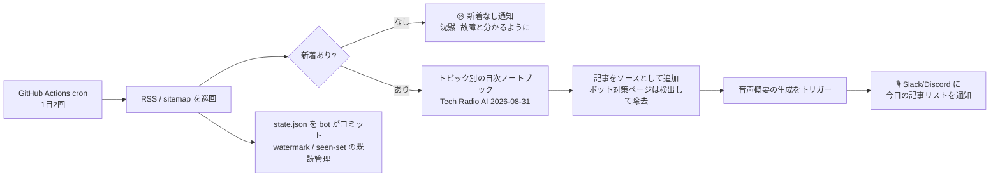

# notebooklm-radio

追いかけている技術ブログの新着を、毎朝 NotebookLM のラジオにして届ける仕組みです。GitHub Actions の cron だけで動くので、サーバーもデータベースも要りません。

[English README](README.en.md)

## これは何

登録した RSS や sitemap を巡回して、新着記事があれば NotebookLM の音声概要(2 人のホストが会話する形式の音声)を生成し、今日のエピソードに入った記事の一覧を Slack か Discord に流します。

作った動機は単純で、英語の技術記事が読むより速く溜まっていく一方で、通勤の 40 分は耳が空いていたからです。音声の言語は既定で日本語ですが、NotebookLM が対応している言語なら変えられます。

手順はスクリーンショット付きで別のページにまとめてあります。

- 導入ガイド: https://inoueuj.github.io/tech-feed-catalog/guide/?lang=ja ([English](https://inoueuj.github.io/tech-feed-catalog/guide/?lang=en))
- フィード選びと `config.yaml` の生成: [設定ビルダー](https://inoueuj.github.io/tech-feed-catalog/)
- フィードの元データ: [tech-feed-catalog](https://github.com/inoueUJ/tech-feed-catalog)([feeds.json](https://inoueuj.github.io/tech-feed-catalog/feeds.json))

## 使う前に知っておいてほしいこと

NotebookLM には公式の API がありません。このプロジェクトは [notebooklm-py](https://github.com/teng-lin/notebooklm-py) という非公式クライアント(リバースエンジニアリングで作られたもの)で NotebookLM を操作しています。Google 側の変更で、ある日突然まるごと動かなくなる可能性があります。

認証には自分の Google アカウントのセッション Cookie を使い、自分のリポジトリの GitHub Actions シークレットに保存します。外部に送られることはありませんが、その代わり自分のアカウントで個人的に使う前提の作りです。他人の認証情報を預かるようなサービスにはしないでください。

セッションは 3.5 週間ほどで切れます。切れたらブラウザでログインし直してシークレットを更新する必要があります(2 分くらいで済む手順を用意しています)。これはバグではなく、仕組み上どうにもならない制約です。理由は [docs/OPERATIONS.md](docs/OPERATIONS.md) に書きました。

生成される音声は他人の記事を要約したものです。自分で聴く範囲にとどめて、ポッドキャストとして再配信するのはやめてください。

## 仕組み


```mermaid
flowchart LR
    A[GitHub Actions cron<br/>1日2回] --> B[RSS / sitemap を巡回]
    B --> C{新着あり?}
    C -- なし --> D[😪 新着なし通知<br/>沈黙=故障と分かるように]
    C -- あり --> E[トピック別の日次ノートブック<br/>Tech Radio AI 2026-08-31]
    E --> F[記事をソースとして追加<br/>ボット対策ページは検出して除去]
    F --> G[音声概要の生成をトリガー]
    G --> H[🎙️ Slack/Discord に<br/>今日の記事リストを通知]
    B --> I[state.json を bot がコミット<br/>watermark / seen-set の既読管理]
```

「1,226 件の記事が新着扱いになった」「認証が切れたまま 16 日間気づかなかった」といった実際の事故と、そこから決めた設計は [docs/DESIGN.md](docs/DESIGN.md) と [docs/OPERATIONS.md](docs/OPERATIONS.md) に残してあります。

## どこを読めばいいか

| したいこと | 読むところ |
|---|---|
| 手順をスクリーンショット付きで追いたい | [導入ガイド](https://inoueuj.github.io/tech-feed-catalog/guide/?lang=ja)(Web ページ。[English](https://inoueuj.github.io/tech-feed-catalog/guide/?lang=en) もあります) |
| とにかく 5 分で動かしたい | 下のクイックスタート |
| 同じ内容を Markdown 1 枚で読みたい。設定の変え方、通知の読み方、困ったときの直し方 | [docs/GUIDE.ja.md](docs/GUIDE.ja.md) |
| フィードを選んで設定を作りたい | [設定ビルダー](https://inoueuj.github.io/tech-feed-catalog/) |
| 生存確認済みのフィード一覧を見たい(開発者向けに 70 以上、毎週チェック) | [tech-feed-catalog](https://github.com/inoueUJ/tech-feed-catalog)([feeds.json](https://inoueuj.github.io/tech-feed-catalog/feeds.json)) |
| `config.yaml` で使えるキーを全部知りたい | [config.schema.json](config.schema.json) |
| なぜこういう作りなのか知りたい | [docs/DESIGN.md](docs/DESIGN.md) |
| 認証の更新手順と、これまでの事故の記録 | [docs/OPERATIONS.md](docs/OPERATIONS.md) |

## クイックスタート

詳しい手順はスクリーンショット付きの[導入ガイド](https://inoueuj.github.io/tech-feed-catalog/guide/?lang=ja)にあります。流れだけ書くと次のとおりです。

1. [設定ビルダー](https://inoueuj.github.io/tech-feed-catalog/)で設定を作ります。追っている技術を選び(Zenn のトピックや Qiita のタグ、任意のフィード URL も足せます)、番組の分け方と実行時刻を決めると、`config.yaml` と cron の 2 行が出てきます。1 日の音声生成上限に対して番組数 × 実行回数が多すぎる、流量の多すぎるフィードがある、同じ記事を配信するフィードを 2 つ選んでいる、といったことはこの時点で警告されます。
2. このリポジトリの「Use this template」から自分のリポジトリを作ります。bot が購読履歴(`state.json`)をコミットし続けるので、Private にしておいてください。作ったら clone します。
3. `config.yaml` をビルダーで作ったものに置き換え、`.github/workflows/rss-radio.yml` の `- cron:` の 2 行も差し替えます。`python radio_batch.py --check-config` で設定ファイルの検査だけができます(ネットワークにも NotebookLM にも触りません)。push まで済ませてください。
4. 手元の PC でウィザードを一度だけ実行します。Python 3.10 以上と [uv](https://docs.astral.sh/uv/getting-started/installation/)、[GitHub CLI](https://cli.github.com/)(`gh auth login` 済み)が必要です。足りないものがあればウィザードが教えてくれます。

   ```bash
   python scripts/setup.py
   ```

   これで `notebooklm` CLI のインストール、ブラウザでの Google ログイン、`NOTEBOOKLM_AUTH_JSON` シークレットの登録、Slack / Discord の webhook URL の登録(`NOTIFY_WEBHOOK_URL`)、初回実行までが一気に済みます。ログインは CI 専用の `ci` プロファイルに保存されます。普段使いのプロファイルと分けないとセッションが 3 日ほどで切れてしまうためで、詳しくは [docs/OPERATIONS.md](docs/OPERATIONS.md) に書いてあります。認証情報の中身が画面に出ることはありません。確認だけしたいときは `python scripts/setup.py doctor` を使ってください。
5. 数分すると、今日の記事一覧とノートブックへのリンクが通知で届きます。音声は [NotebookLM](https://notebooklm.google.com) 側で 20 分ほどかけて作られます。初回は各フィードの最新 1 件だけを処理して、それより古い記事は既読扱いにするので、過去記事が一気に流れ込むことはありません。1 週間ほど経つと 🧹 付きで削除対象の一覧が通知されるので、古いラジオだけが挙がっていることを確かめてから `cleanup.dry_run: false` にしてください。

あとは放っておけば毎日回ります。`state.json` は bot が管理するので手で触らないでください。3.5 週間ほどで Google のセッションが切れてエラー通知が来たら、`python scripts/setup.py renew` を実行すれば 2 分ほどで復旧します。

## 設定リファレンス

設定は `config.yaml` の 1 ファイルにまとまっていて、コメントも書いてあります。

| キー | 何をするか |
|---|---|
| `feeds[].topic` | トピックごとに 1 日 1 ノートブック、1 本のラジオになる。関係ない話題を混ぜると番組が散らかるので分ける。 |
| `feeds[].type: sitemap` | RSS のないサイト向け。`sitemap.xml` を読み、`prefix` 配下の URL を記事として扱う。 |
| `feeds[].source_mode: text` | 記事 URL を渡しても中身が正しく入らないフィード向け。ボット対策で NotebookLM の取得が弾かれるホストと、リンクが 1 ページ内の `#` 位置になっている変更履歴がこれにあたる(URL のままだとページ全体が毎回入る)。URL の代わりにフィードの配信内容をテキストとして入れる。本文が配信されていれば本文を、要約しかなければ「要約のみ」と明示して入れる。 |
| `feeds[].categories` | RSS のカテゴリで記事を絞る。書いたカテゴリのどれかが付いた記事だけを拾う(大文字小文字は区別しない)。発表と会社の話題や導入事例が混ざるフィードで `[Product, Research]` のように使う。sitemap 型では無視される。 |
| `feeds[].mode: latest` | アグリゲータのように流量の多いフィード向け。毎回最新の N 件だけ拾い、残りは意図的に既読にする。既定の backlog モードは古い順に消化して何も捨てない。 |
| `topics.<name>.audio` | トピック別に音声設定を上書きする。`format`(deep-dive / brief / critique / debate)、`length`、`prompt`、`language`。 |
| `settings.notebook_title_format` | 自動削除の対象は、この形式に完全一致するタイトルだけ。手で作ったノートブックには触らない。 |
| `settings.timezone` | ノートブックの日付と月次判定の基準。runner は UTC なので必ず自分のタイムゾーンを入れる。 |
| `settings.limits` | 1 回に処理する記事数。超えた分は捨てずに次回へ持ち越す。 |
| `settings.max_age_hours` | 公開からこの時間を過ぎた記事は流さずに既読にし、Slack に一覧だけ出す(既定は無効)。朝に最新のニュースだけを聞きたいときに、障害明けの溜まった記事や遅れて現れた記事が何日も後に流れるのを防ぐ。 |
| `settings.audio` | 全体の音声設定。`format`、`length`、`prompt`、`scope`(既定の `run` はその回に入れた記事だけで 1 本。`notebook` にするとその日のノートブック全体)。 |
| `settings.cleanup` | 古い日次ノートブックの自動削除。初期状態は `dry_run: true` で、削除予定の一覧が正しいことを確かめてから false にする。 |
| `watch:` | 通知だけのページ監視。ラジオにはしない。 |

設定を変えたら `python radio_batch.py --check-config` で検査できます。`config.yaml` を読むだけで、ネットワークにも NotebookLM にもアクセスしません。CI でも毎回 batch の前に同じ検査を通すので、`feeds:` を `feed:` と書いてしまったような typo は、既定値で黙って動くのではなくエラーで止まります。使えるキーの一覧は [config.schema.json](config.schema.json) にあります。

## 運用で知っておくこと

認証は 3.5 週間ほどで切れます。切れると原因を書いたエラー通知が届くので、`python scripts/setup.py renew` を実行してください。詳しい手順は [docs/OPERATIONS.md](docs/OPERATIONS.md) にあります。

新着がない日でも 😪 の通知は届くようにしてあります。通知が何も来ない日があったら、それは故障です。Actions タブを見てください。

音声の生成は「開始した」時点で成功扱いです。Google 側でレンダリングに失敗しても、実行は失敗になりません。生成の開始そのものに失敗したとき(ほとんどは NotebookLM の 1 日あたりの生成上限で、無料枠は 3 本です)は、記事はノートブックに入った状態のまま、原因を添えたエラー通知が別に届きます。その場合はアプリから手動で生成してください。

Private リポジトリの GitHub Actions の無料枠は、1 日 2 回の実行なら十分に収まります。1 回は数分で終わり、タイムアウトの 30 分は最悪の場合の値です。

## 設計について

いちばん手間がかかったのは既読管理です。RSS フィードは最後に処理した記事の公開時刻(watermark)で管理し、sitemap フィードは既読 URL の集合で管理しています。どちらも逆の方式を使うと実際に事故になります。その経緯や、ボット対策ページの検出、User-Agent の偽装やプラグイン化など「あえてやらないこと」は [docs/DESIGN.md](docs/DESIGN.md) にまとめました。

## サポート

個人プロジェクトなので、対応はできる範囲で行います。issue や PR は歓迎しますが、SLA のようなものはありません。NotebookLM 側に変更があると、notebooklm-py が追従するまで止まります。

## クレジットとライセンス

NotebookLM の操作には Teng Lin さんの [notebooklm-py](https://github.com/teng-lin/notebooklm-py)(MIT)を使っています。このプロジェクトは丸ごとこれに依存しています。

ライセンスは [MIT](LICENSE) です。
